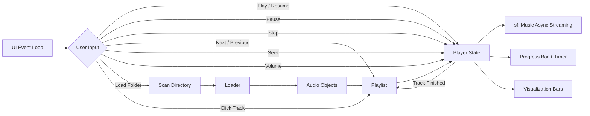
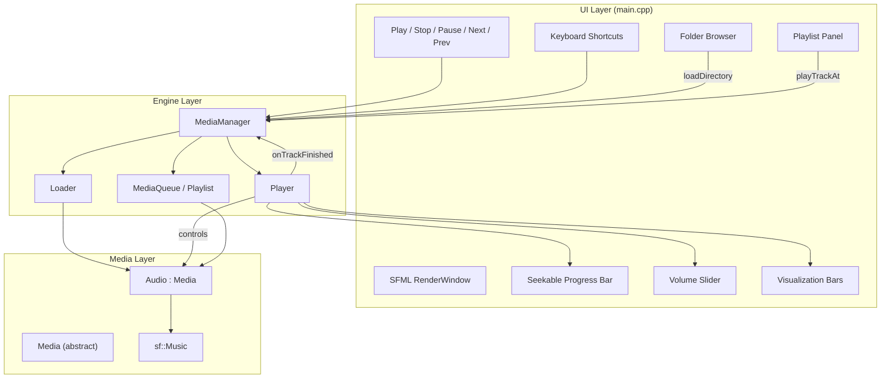

<p align="center">
  
</p>

<h1 align="center">mediaPlayer</h1>

<p align="center">
  <strong>A media player built from scratch in C++. Learning every layer, from audio decoding to UI rendering.</strong>
</p>

<p align="center">
  
  
  
  
  
  
</p>

<p align="center">
  <a href="#features">Features</a> •
  <a href="#how-it-works">How It Works</a> •
  <a href="#quick-start">Quick Start</a> •
  <a href="#architecture">Architecture</a> •
  <a href="#project-layout">Project Layout</a> •
  <a href="#roadmap">Roadmap</a>
</p>

---

## Features

| Feature | Description |
|---------|-------------|
| 🎵 **Audio Playback** | MP3, OGG, WAV, FLAC playback via SFML's audio module (`sf::Music` streaming) |
| ▶️ **Transport Controls** | Play, Pause, Resume, Stop, Next Track, and Previous Track |
| 🔀 **Seek & Scrub** | Click or drag the progress bar to seek to any position in the track |
| 🔊 **Volume Control** | Adjustable volume slider with drag support and keyboard shortcuts |
| 📊 **Visualization** | Smooth animated frequency-style visualization bars (64 bars) |
| 📈 **Progress Tracking** | Real-time progress bar with draggable knob, elapsed / total time display |
| 🎶 **Playlist** | Persistent playlist with track navigation, click-to-play, and auto-advance |
| 📂 **Folder Browser** | Built-in folder browser to load music from any directory |
| 🎹 **Keyboard Shortcuts** | Space, S, N, P, Arrow keys for full keyboard-driven control |
| 🧵 **Asynchronous Playback** | SFML streams audio on its internal worker thread while the UI stays responsive |
| 🏗️ **Extensible Design** | Abstract `Media` base class — add Video or other media types without touching the engine |
| ⚙️ **Zero Dependencies** | SFML is fetched automatically via CMake FetchContent — just clone and build |

---

## How It Works



1. **Scan** — On startup (or via the folder browser), the player scans a directory for audio files (`.mp3`, `.ogg`, `.wav`, `.flac`) and loads them into the playlist.
2. **Load** — The `Loader` factory creates `Audio` objects (wrapping `sf::Music`) for each file.
3. **Playlist** — Tracks are held in a persistent `std::vector` with index-based navigation (next, previous, jump-to-track).
4. **Play** — The `Player` controls SFML's asynchronous audio stream while the main thread renders the UI. When a track finishes, the next track auto-advances.
5. **Render** — The SFML event loop handles button clicks, keyboard shortcuts, seek previews, volume dragging, playlist clicks, and animates the visualization.

---

## Quick Start

### Prerequisites

- CMake 3.22+
- A C++17 compiler (GCC, Clang, or MSVC)
- SFML 2.6.x is fetched automatically — no manual install needed

### macOS

```bash
brew install cmake
git clone https://github.com/hariharanragothaman/mediaPlayer.git
cd mediaPlayer
cmake -S . -B build
cmake --build build
./build/media_player
```

### Linux (Ubuntu/Debian)

```bash
sudo apt-get install cmake g++ libglu1-mesa-dev freeglut3-dev mesa-common-dev
git clone https://github.com/hariharanragothaman/mediaPlayer.git
cd mediaPlayer
cmake -S . -B build
cmake --build build
./build/media_player
```

### Usage

By default, the player scans `~/Music` for audio files on startup. You can also pass a directory as a command-line argument:

```bash
cd build && ./media_player                   # scans ~/Music
cd build && ./media_player /path/to/music    # scans given directory
```

Once running, use the built-in folder browser (click the Load button or press `L`) to load music from any folder.

#### Keyboard Shortcuts

| Key | Action |
|-----|--------|
| `Space` | Play / Pause toggle |
| `S` | Stop |
| `N` / `→` | Next track |
| `P` / `←` | Previous track |
| `↑` | Volume up |
| `↓` | Volume down |
| `L` | Open folder browser |
| `Esc` | Close folder browser |

---

## Architecture

### Design Decisions

| Decision | Rationale |
|----------|-----------|
| **Abstract `Media` base class** | All playback operations (play, pause, seek, volume) are virtual — add Video or other types without modifying the engine |
| **SFML-managed audio thread** | `sf::Music::play()` is asynchronous, so SFML handles streaming without a second application-owned playback thread |
| **Single-threaded player state** | Playback controls and auto-advance run in the UI loop, avoiding races during seek, stop, and track changes |
| **Auto-advance callback** | Player fires an `onTrackFinished` callback so MediaManager automatically advances to the next track |
| **Facade pattern (`MediaManager`)** | Coordinates Loader, Playlist, and Player behind a single interface so `main.cpp` stays simple |
| **CMake FetchContent for SFML** | Zero manual dependency setup — clone, configure, build. Works on macOS and Linux out of the box |

### Component Diagram



---

## Project Layout

```
mediaPlayer/
├── src/
│   ├── main.cpp              # SFML window, event loop, UI rendering
│   ├── media.h / media.cpp   # Abstract base class for all media types
│   ├── audio.h / audio.cpp   # Audio implementation (wraps sf::Music)
│   ├── player.h / player.cpp # Playback state and transport controls
│   ├── queue.h / queue.cpp   # std::vector-backed persistent playlist
│   ├── loader.h / loader.cpp # Factory: file path → Media object
│   └── mediaManager.h/.cpp   # Facade coordinating loader, queue, player
├── assets/                   # UI assets (button icons, fonts)
│   ├── play.png
│   ├── pause.png
│   ├── stop.png
│   ├── nextTrack.png
│   ├── loadMusic.png
│   ├── shuffle.png
│   └── arial.ttf
├── .github/workflows/
│   └── cmake-multi-platform.yml  # CI: build on Ubuntu
├── CMakeLists.txt            # Build config, SFML via FetchContent
├── LICENSE                   # MIT
└── README.md
```

---

## Roadmap

This is a learning project aiming toward VLC-level understanding of media player internals.

### Completed

- [x] Audio playback (MP3, OGG, WAV, FLAC) via SFML
- [x] Play, Pause, Resume, Stop controls
- [x] Next Track / Previous Track navigation
- [x] Asynchronous SFML playback (UI stays responsive)
- [x] Seekable progress bar with drag support
- [x] Volume control slider with drag support
- [x] Current track name and index display
- [x] Keyboard shortcuts (Space, S, N, P, arrows, L)
- [x] Playlist panel with click-to-play
- [x] Built-in folder browser for loading music
- [x] Auto-advance to next track on completion
- [x] Smooth animated visualization bars
- [x] CI pipeline (GitHub Actions)

### Up Next

- [ ] Shuffle mode
- [ ] Repeat modes (repeat-all, repeat-one)
- [ ] Playlist save/load (M3U format)
- [ ] Real audio spectrum visualization (FFT-based)
- [ ] Equalizer (bass, mid, treble)

### Future

- [ ] Video playback support
- [ ] Skinnable UI / theming
- [ ] Album art display
- [ ] Subtitle rendering
- [ ] System media key integration
- [ ] Cross-platform packaging (DMG, AppImage, MSI)

---

## Contributing

1. Fork the repo
2. Create a feature branch (`git checkout -b feature/my-feature`)
3. Build and test locally (`cmake -S . -B build && cmake --build build`)
4. Open a PR

---

## License

[MIT](./LICENSE) — Hariharan Ragothaman
