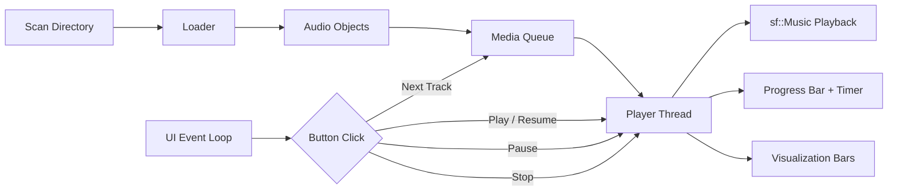
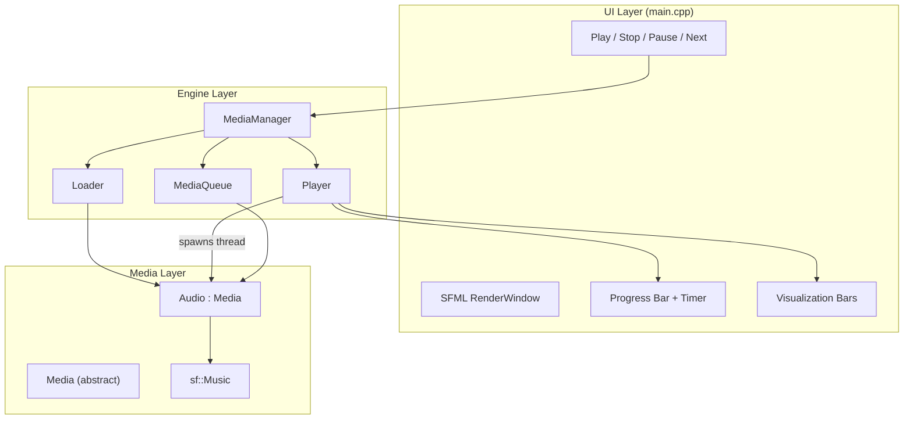

<p align="center">
  
</p>

<h1 align="center">mediaPlayer</h1>

<p align="center">
  <strong>A media player built from scratch in C++. Learning every layer, from audio decoding to UI rendering.</strong>
</p>

<p align="center">
  
  
  
  
  
  
</p>

<p align="center">
  <a href="#features">Features</a> •
  <a href="#how-it-works">How It Works</a> •
  <a href="#quick-start">Quick Start</a> •
  <a href="#architecture">Architecture</a> •
  <a href="#project-layout">Project Layout</a> •
  <a href="#roadmap">Roadmap</a>
</p>

---

## Features

| Feature | Description |
|---------|-------------|
| 🎵 **Audio Playback** | MP3 playback via SFML's audio module (`sf::Music` streaming) |
| ▶️ **Transport Controls** | Play, Pause, Resume, Stop, and Next Track buttons |
| 📊 **Visualization** | Animated frequency-style visualization bars (64 bars) |
| 📈 **Progress Tracking** | Real-time progress bar with elapsed / total time display |
| 🎶 **Media Queue** | Sequential playback queue — load multiple tracks, advance automatically |
| 🧵 **Threaded Playback** | Dedicated playback thread keeps the UI responsive at all times |
| 🏗️ **Extensible Design** | Abstract `Media` base class — add Video or other media types without touching the engine |
| ⚙️ **Zero Dependencies** | SFML is fetched automatically via CMake FetchContent — just clone and build |

---

## How It Works



1. **Scan** — On startup, the player scans a directory for `.mp3` files and loads them into the media queue.
2. **Load** — The `Loader` factory creates `Audio` objects (wrapping `sf::Music`) for each file.
3. **Queue** — Tracks are held in a `std::deque`-backed queue with peek, pop, and add operations.
4. **Play** — The `Player` spawns a dedicated thread that streams audio via SFML while the main thread renders the UI.
5. **Render** — The SFML event loop handles button clicks, updates the progress bar, and animates the visualization.

---

## Quick Start

### Prerequisites

- CMake 3.22+
- A C++17 compiler (GCC, Clang, or MSVC)
- SFML 2.6.x is fetched automatically — no manual install needed

### macOS

```bash
brew install cmake
git clone https://github.com/hariharanragothaman/mediaPlayer.git
cd mediaPlayer
cmake -S . -B build
cmake --build build
./build/media_player
```

### Linux (Ubuntu/Debian)

```bash
sudo apt-get install cmake g++ libglu1-mesa-dev freeglut3-dev mesa-common-dev
git clone https://github.com/hariharanragothaman/mediaPlayer.git
cd mediaPlayer
cmake -S . -B build
cmake --build build
./build/media_player
```

### Usage

By default, the player scans `/tmp` for `.mp3` files on startup. Drop some MP3s there and launch the player:

```bash
cp ~/Music/*.mp3 /tmp/
cd build && ./media_player
```

---

## Architecture

### Design Decisions

| Decision | Rationale |
|----------|-----------|
| **Abstract `Media` base class** | Makes it straightforward to add Video, Podcast, or other types without modifying the playback engine |
| **Dedicated playback thread** | SFML audio streaming blocks until the track finishes — a separate thread keeps the UI at 60 fps |
| **`std::atomic` for state flags** | `isPlaying` and `isPaused` are accessed from both the UI and playback threads — atomics avoid data races |
| **Facade pattern (`MediaManager`)** | Coordinates Loader, Queue, and Player behind a single interface so `main.cpp` stays simple |
| **CMake FetchContent for SFML** | Zero manual dependency setup — clone, configure, build. Works on macOS and Linux out of the box |

### Component Diagram



---

## Project Layout

```
mediaPlayer/
├── src/
│   ├── main.cpp              # SFML window, event loop, UI rendering
│   ├── media.h / media.cpp   # Abstract base class for all media types
│   ├── audio.h / audio.cpp   # Audio implementation (wraps sf::Music)
│   ├── player.h / player.cpp # Threaded playback engine
│   ├── queue.h / queue.cpp   # std::deque-backed media queue
│   ├── loader.h / loader.cpp # Factory: file path → Media object
│   └── mediaManager.h/.cpp   # Facade coordinating loader, queue, player
├── assets/                   # UI assets (button icons, fonts)
│   ├── play.png
│   ├── pause.png
│   ├── stop.png
│   ├── nextTrack.png
│   ├── loadMusic.png
│   ├── shuffle.png
│   └── arial.ttf
├── .github/workflows/
│   └── cmake-multi-platform.yml  # CI: build on Ubuntu
├── CMakeLists.txt            # Build config, SFML via FetchContent
├── LICENSE                   # MIT
└── README.md
```

---

## Roadmap

This is a learning project aiming toward VLC-level understanding of media player internals.

### Completed

- [x] Audio playback (MP3) via SFML
- [x] Play, Pause, Resume, Stop controls
- [x] Next Track with queue advancement
- [x] Threaded playback (UI stays responsive)
- [x] Progress bar with elapsed / total time
- [x] Animated visualization bars
- [x] Media queue with sequential playback
- [x] CI pipeline (GitHub Actions)

### Up Next

- [ ] Seek / scrub via progress bar click
- [ ] Volume control slider
- [ ] Keyboard shortcuts (Space = pause, N = next, etc.)
- [ ] File browser dialog for loading media

### Future

- [ ] Video playback support
- [ ] Playlist management (load/save, reorder, shuffle)
- [ ] Equalizer (bass, mid, treble)
- [ ] Real audio spectrum visualization (FFT-based)
- [ ] Support for more formats (FLAC, WAV, OGG, MP4, AVI)
- [ ] Subtitle rendering
- [ ] Cross-platform packaging (DMG, AppImage, MSI)

---

## Contributing

1. Fork the repo
2. Create a feature branch (`git checkout -b feature/my-feature`)
3. Build and test locally (`cmake -S . -B build && cmake --build build`)
4. Open a PR

---

## License

[MIT](./LICENSE) — Hariharan Ragothaman
